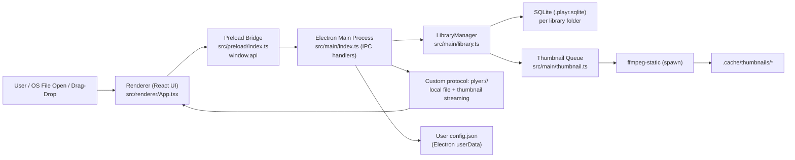

# Project Overview
Plyer is a desktop video player built with Electron, React, Vite, and TypeScript that treats a
folder as a media library. It scans local video files, stores metadata/tags/ratings/playlists in a
per-folder SQLite database (`.playr.sqlite`), generates thumbnails locally with FFmpeg, and
supports opening folders/files directly (including OS file-open events and drag-and-drop).

## Repository Structure
- `0Meta/` - Local project notes, mockups, sample media, and scratch data used for planning/manual
  testing.
- `assets/` - Application icons and static image assets used by the Electron shell.
- `dist/` - Build output for Electron main/preload and Vite renderer bundles.
- `node_modules/` - Installed dependencies (generated; do not edit manually).
- `src/` - Source code for the Electron app (main, preload, renderer, and shared types).
- `src/main/` - Electron main process, IPC handlers, local protocol streaming, DB/library logic, and
  thumbnail generation.
- `src/preload/` - Secure preload bridge that exposes the renderer API via `contextBridge`.
- `src/renderer/` - React UI, Tailwind/CSS styling, and Vite HTML entrypoint.
- `src/shared/` - Shared TypeScript types used across main/preload/renderer boundaries.
- `Readme.md` - Product description, feature list, and high-level behavior notes.
- `package.json` - NPM scripts and dependencies for build/dev workflows.
- `package-lock.json` - Locked dependency graph for npm installs.
- `vite.config.ts` - Vite config for the renderer app, aliases, and build output paths.
- `tailwind.config.cjs` - Tailwind theme extensions and scan paths for renderer files.
- `postcss.config.cjs` - PostCSS plugin setup (`tailwindcss`, `autoprefixer`).
- `tsconfig.json` - TS project references for the split Electron/Vite targets.
- `tsconfig.main.json` - TypeScript config for Electron main process output.
- `tsconfig.preload.json` - TypeScript config for Electron preload output.
- `tsconfig.renderer.json` - TypeScript config for the renderer app.

## Build & Development Commands
### Install dependencies
```sh
npm install
```

### Run locally (development)
```sh
npm run dev
```

### Debug (Electron + renderer dev server)
```sh
npm run dev -- /path/to/folder-or-video
```

### Build (all targets)
```sh
npm run build
```

### Build (individual targets)
```sh
npm run build:main
npm run build:preload
npm run build:renderer
```

### Preview renderer bundle
```sh
npm run preview
```

### Rebuild native Electron dependency
```sh
npm run rebuild:electron
```

### Type-check
> TODO: No dedicated `type-check` script is defined. Main/preload type errors are surfaced during
> `npm run build:main` and `npm run build:preload`; renderer has no standalone `tsc --noEmit`
> command wired in `package.json`.

### Lint
> TODO: No lint script or ESLint/Prettier config is present in the repository.

### Test
> TODO: No test framework or test script is configured in `package.json`.

### Deploy / Package
> TODO: No packaging or release command (for macOS/Windows/Linux installers) is configured.

## Code Style & Conventions
1. Use TypeScript everywhere and keep types in `src/shared/types.ts` when crossing IPC boundaries.
2. Follow the existing naming pattern: `PascalCase` for React components/types, `camelCase` for
   functions/variables, and `UPPER_SNAKE_CASE` for module-level constants.
3. Keep Electron boundaries explicit: renderer code calls `window.api`; only preload talks to
   `ipcRenderer`; only main process touches Node/Electron internals directly.
4. IPC channel names use a `scope:action` format (examples: `playlist:get`, `file:set-rating`).
5. Preserve strict TypeScript behavior (`"strict": true`) across main/preload/renderer configs.
6. Use Tailwind utility classes in JSX plus small custom classes in `src/renderer/index.css` for
   shared styling quirks (scrollbars, ranges, select option fixes, etc.).
7. Formatting is currently convention-based (semicolons, double quotes, 2-space indentation in
   existing files).
8. Lint/formatter config:
   > TODO: No ESLint or Prettier configuration files are present.
9. Commit message template:
   > TODO: No commit message convention is documented in this repository.

## Architecture Notes


Plyer is a single-process Electron app with a React renderer and a preload bridge. The renderer
manages player UI state, pagination, filters, and drag/drop, then calls `window.api` methods
exposed by `src/preload/index.ts`. The main process owns all privileged operations: file system
access, SQLite reads/writes, window sizing/persistence, OS media key shortcuts, and streaming local
media through a custom `plyer://` protocol (including range requests). `LibraryManager` scans the
library root for supported video files, syncs records into `.playr.sqlite`, and returns playlist
pages; thumbnail generation is queued in the main process and pushes `library:thumbnail-ready`
events back to the renderer over IPC.

## Testing Strategy
1. Current state: no unit, integration, or e2e test framework is configured.
2. Local validation (manual): run `npm run dev`, choose/drop a folder with videos, scan the library,
   verify playback, tagging, rating, filters, playlist paging, and thumbnail generation.
3. Native-module validation: run `npm run rebuild:electron` if `better-sqlite3` fails after
   Electron/version changes.
4. CI:
   > TODO: No CI workflow files (for test/lint/build automation) were found in this repository.
5. Test roadmap:
   > TODO: Add unit tests for query/filter logic in `src/main/library.ts`, IPC contract tests for
   > preload/main handlers, and renderer interaction tests for playlist/filter controls.

## Security & Compliance
1. Renderer isolation is enabled (`contextIsolation: true`) and Node integration is disabled
   (`nodeIntegration: false`); keep new privileged APIs behind the preload bridge only.
2. The app primarily operates on local files and a local SQLite DB (`.playr.sqlite`) inside the
   selected library root; avoid adding networked data flows without explicit review.
3. Secrets handling:
   > TODO: No secret management policy is documented; currently no obvious application secrets are
   > stored in repo source files.
4. Dependency scanning:
   > TODO: No automated dependency scanning/audit workflow is configured.
5. License/compliance:
   > TODO: No top-level `LICENSE` file was found. Verify redistribution/licensing obligations for
   > Electron and bundled FFmpeg-related dependencies (`ffmpeg-static`, `ffprobe-static`) before
   > shipping installers.
6. Data handling guardrail: do not commit local DB/cache/media artifacts (examples: `.playr.sqlite`,
   `.cache/`, sample videos, generated thumbnails) unless explicitly intended as fixtures.

## Agent Guardrails
1. Do not edit `node_modules/` or generated build outputs in `dist/` unless the user explicitly asks
   for generated artifacts.
2. Treat `0Meta/Samples/`, `0Meta/.cache/`, `0Meta/*.png`, and local `.playr.sqlite` files as
   reference/test assets; avoid rewriting or deleting them during routine code changes.
3. Preserve IPC and security boundaries: do not expose new Node/Electron capabilities directly to
   the renderer; add them through `src/preload/index.ts` + typed contracts in `src/shared/types.ts`.
4. Changes to `src/main/index.ts` (protocol handling, file streaming, window lifecycle, shortcuts)
   require extra review because they affect app security and platform behavior.
5. Changes to DB schema in `src/main/db.ts` should include a migration/backward-compatibility plan.
6. Rate limits:
   > TODO: No external API rate-limit policy applies today (app is local-only). Add one if network
   > services are introduced.
7. Review requirements:
   > TODO: No formal CODEOWNERS/review policy is defined in this repository.

## Extensibility Hooks
1. Preload API surface (`window.api` in `src/preload/index.ts`) is the primary extension point for
   new renderer-visible capabilities.
2. Shared IPC contract types in `src/shared/types.ts` are the canonical place to extend payloads and
   responses safely across processes.
3. `LibraryManager` (`src/main/library.ts`) is the main hook for new library scans, metadata
   enrichment, playlist filters, and sort modes.
4. Thumbnail pipeline (`src/main/thumbnail.ts`) is isolated and can be extended for alternate sizes,
   formats, or extraction strategies.
5. Custom protocol handler in `src/main/index.ts` (`plyer://`) is the place to extend secure local
   media/asset delivery behavior.
6. Environment variable: `VITE_DEV_SERVER_URL` is used by the main process in dev mode to load the
   renderer and open detached DevTools.
7. Feature flags:
   > TODO: No feature flag system is implemented.

## Further Reading
- [`Readme.md`](Readme.md)
- [`0Meta/Next Steps.md`](0Meta/Next%20Steps.md)
- [`0Meta/DB.txt`](0Meta/DB.txt)
- [`src/main/index.ts`](src/main/index.ts)
- [`src/main/library.ts`](src/main/library.ts)
- [`src/main/db.ts`](src/main/db.ts)
- [`src/preload/index.ts`](src/preload/index.ts)
- [`src/renderer/App.tsx`](src/renderer/App.tsx)
